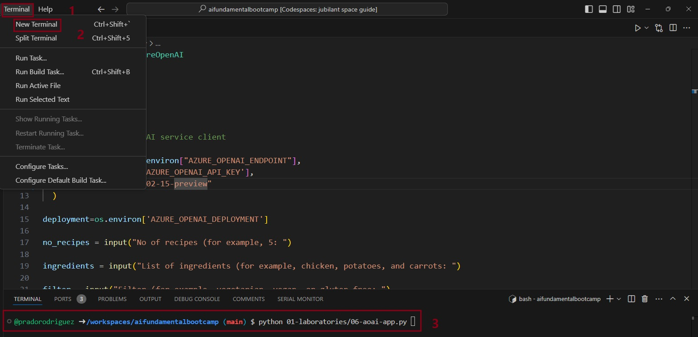

# Setup Your Dev Environment

After setting up the [working environment](./README.md), it is time to configure specific items to make the code work.

## 1. Executing Assignments

This section provides general guidance related to executing those assignments.

### 1.1. Python Assignments

Python assignments are provided either as Jupyter notebooks (`.ipynb` files) or applications (`.py` files).

* **To run the Jupyter Notebook**, open it in Github Codespaces Visual Studio Code, then click **Select Kernel** (at top right) and select the default **Python 3.12.1** option shown. You can now **Run** each action or **Run All** to execute the whole notebook.


* **To run Python applications from command-line**, open a new bash cli by clicking the **Terminal** buttom in the main menu, and execute the code by running `python 01-laboratories/<app_name>.py`.



## 2. Configuring Providers

Assignments **may** also be setup to work against one or more Large Language Model (LLM) deployments through a supported service provider like Azure OpenAI. This provides a **hosted endpoint** (API) that we can access programmatically with the right credentials (API key or token). In this course, we discuss theis provider:

* [Azure OpenAI](https://learn.microsoft.com/azure/ai-services/openai/) for OpenAI models with enterprise readiness in focus.

**You will need to use your own accounts for these exercises**. Some guidance for signup:

| Signup | Cost | API Key | Playground | Comments |
|:---|:---|:---|:---|:---|
| [Azure](https://aka.ms/azure/free)| [Pricing](https://azure.microsoft.com/pricing/details/cognitive-services/openai-service/)| [SDK Quickstart](https://learn.microsoft.com/azure/ai-services/openai/quickstart)| [Studio Quickstart](https://learn.microsoft.com/azure/ai-services/openai/quickstart) | [Apply Ahead For Access](https://learn.microsoft.com/azure/ai-services/openai/) |
| | | | | |

Follow the directions below to **configure** this repository for use with Azure OpenAI:

* `aoai` - requires Azure OpenAI endpoint, key, version and deployment name

Assignments will simply error out on missing credentials.

### 2.1. Create `.env` file

We assume that you have already read the guidance above, created the Azure OpenAI service, obtained the required authentication credentials (API_KEY) and have the endpoint URL.

The next step is to configure your **local environment variables** as follows:

1. Click your [GitHub CodeSpaces container](https://github.com/codespaces).
1. Inside the online Visual Studio Code **Explorer** section (to the left), look in the root folder for a `.env.copy` file
1. Copy that file to `.env` using the command below. This file is _gitignore-d_, keeping secrets safe.

Open the Codespaces Visual Studio Code **Terminal** cli and execute the following command:

   ```bash
   cp .env.copy .env
   ```

1. Fill in the values (replace placeholders on right side of `=`) as described in the next section.

> [!NOTE]
> If you use GitHub Codespaces, you have the option to save environment variables as **Codespaces secrets** associated with this repository.
>
> In that case, you won't need to setup a local `.env` file.
> **Note that this option works only if you use GitHub Codespaces.**
>
> You will still need to setup the `.env` file if you use your local Visual Studio Code tool.

### 2.2. Populate `.env` file

Let's take a quick look at the variable names to understand what they represent:

| Variable  | Description  |
| :--- | :--- |
| AZURE_OPENAI_API_VERSION | This is the Azure OpenAI API version. _This value is prepopulated, no need to modify it_ |
| AZURE_OPENAI_API_KEY | This is the authorization key for using Azure OpenAI |
| AZURE_OPENAI_ENDPOINT | This is the deployed endpoint URL for an Azure OpenAI resource |
| AZURE_OPENAI_DEPLOYMENT | This is the _text generation_ **GPT-4 turbo-2024-04-09** model deployment name |
| AZURE_OPENAI_EMBEDDINGS_DEPLOYMENT | This is the _text embeddings_ **text-embedding-ada-002** model deployment name |
| | |

### 2.3 Get Azure OpenAI access values: From Portal

The Azure OpenAI endpoint and key values will be found in the [Azure Portal](https://portal.azure.com) so let's start there.

1. Go to the [Azure Portal](https://portal.azure.com).
1. Go to the Azure OpenAI resource.
1. Expand the **Resource Management** section in the sidebar (menu at left)
1. Click the **Keys and Endpoint** option.
1. Click **Show Keys** - you should see the following: KEY 1, KEY 2 and Endpoint.
1. Use the **KEY 1** value for **AZURE_OPENAI_API_KEY**.
1. Use the **Endpoint** value for **AZURE_OPENAI_ENDPOINT**.

Next, we need to create deployments from the Azure OpenAI models.

1. Click the **Model deployments** option in the sidebar (left menu) for Azure OpenAI resource.
1. In the destination page, click **Manage Deployments**
1. (Optional) You can directly navigate to the [Azure OpenAI Studio website](https://oai.azure.com).

This will take you to the Azure OpenAI Studio website, where we'll find the other values as described below.

### 2.4 Get Azure OpenAI deployments: From Studio

1. Navigate to [Azure OpenAI Studio](https://oai.azure.com) **from your resource** as described above.
1. Click the **Deployments** tab (sidebar, left) to view currently deployed models.
1. If your desired model is not deployed, use **Create new deployment** to deploy it. If using the new portal, use **Deploy model** button.
1. You will need a _text-generation_ model - deploy the following model: **GPT-4 turbo-2024-04-09**
1. You will need a _text-embedding_ model - deploy the following model: **text-embedding-ada-002**

Now update the environment variables from the `.env` file to reflect the **Deployment name** used from above. This will typically be the same as the model name unless you changed it explicitly. So, as an example, you might have:

```bash
## Azure OpenAI
AZURE_OPENAI_API_VERSION='2024-02-15-preview' # Default is set!
AZURE_OPENAI_API_KEY='<API-KEY-STRING>'
AZURE_OPENAI_ENDPOINT='https://<endpoint-url>.openai.azure.com/'
AZURE_OPENAI_DEPLOYMENT='gpt-4-turbo-2024-04-09' 
AZURE_OPENAI_EMBEDDINGS_DEPLOYMENT='text-embedding-ada-002'
```

**Don't forget to save the .env file when done**. You can now exit the file and follow your instructor's instructions.

## Let's Get Started

Now that you have completed the needed steps to complete this course, let's get started with the [laboratories](../01-laboratories/README.md).

## Disclaimer

> [!NOTE]
> This project has adopted the [Microsoft Open Source Code of Conduct](https://opensource.microsoft.com/codeofconduct/). For more information read the Code of Conduct FAQ or contact [Email opencode](opencode@microsoft.com) with any additional questions or comments.
